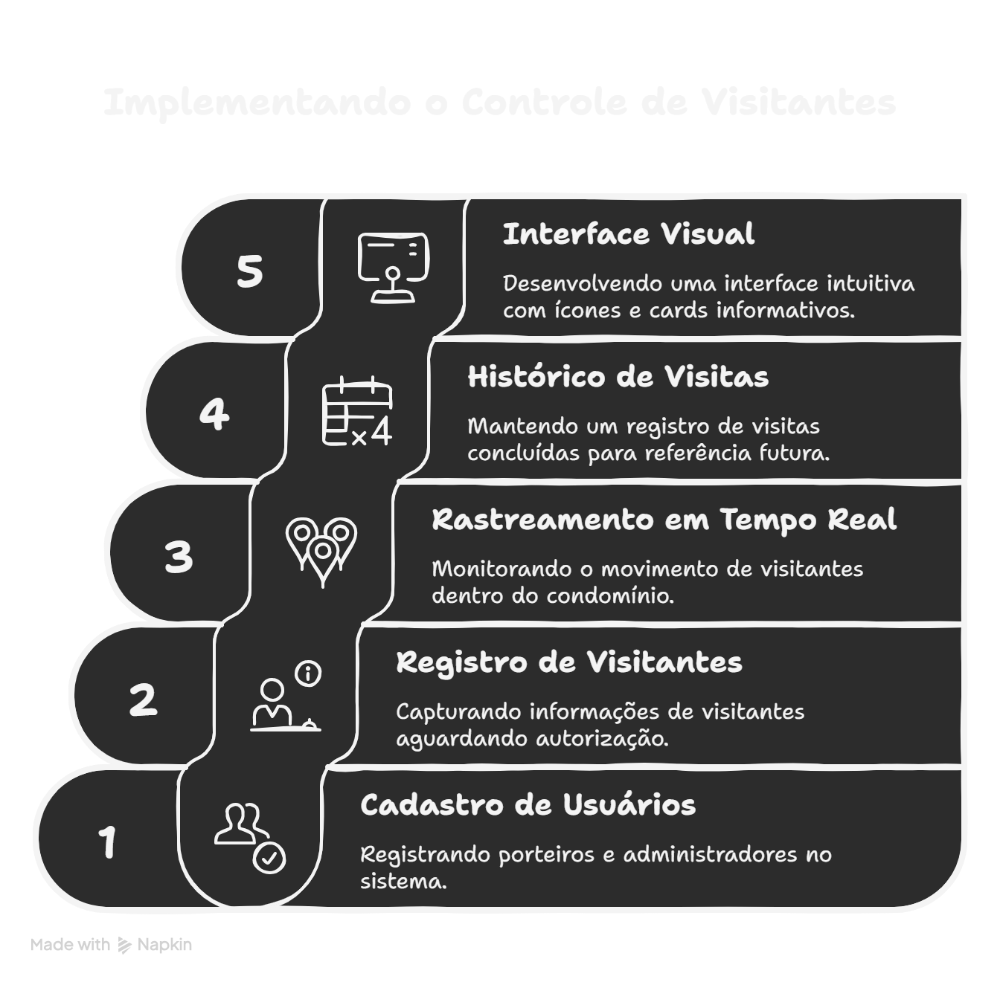
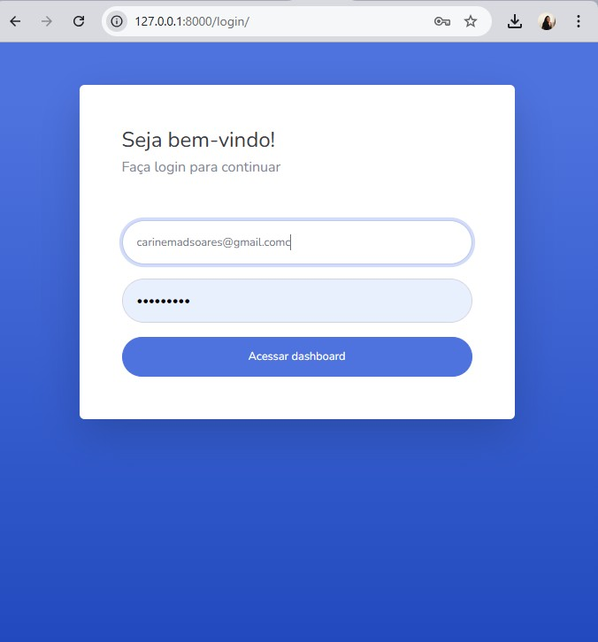
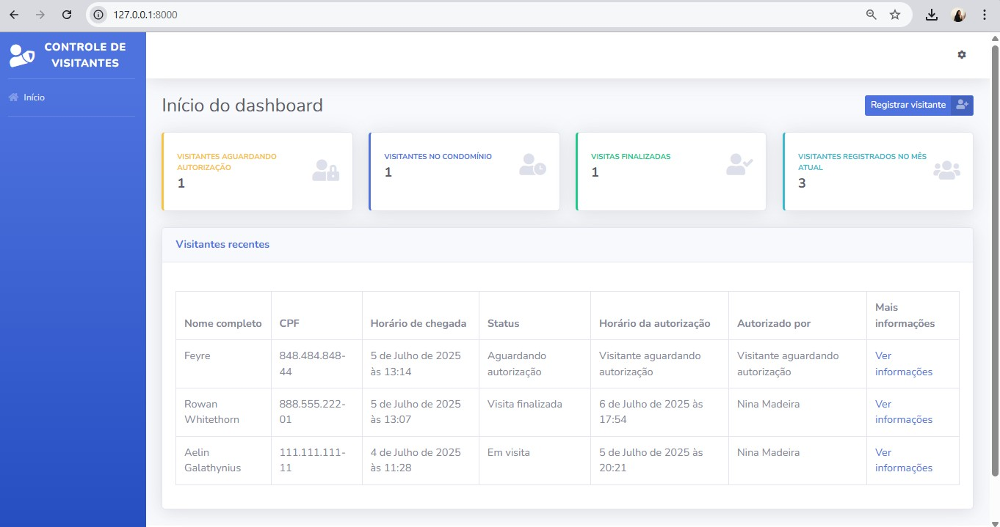
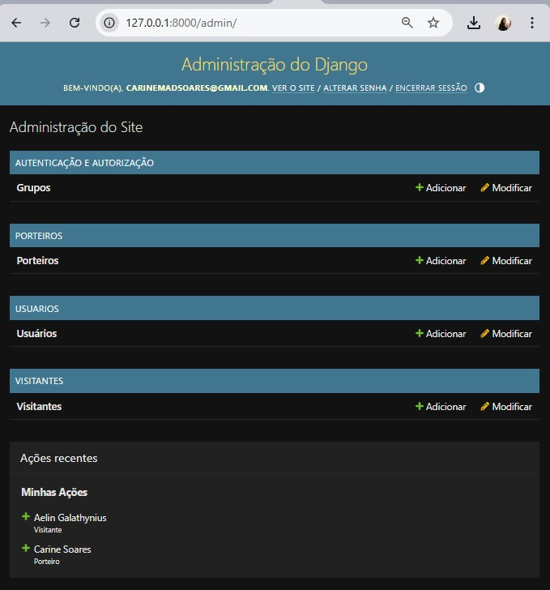
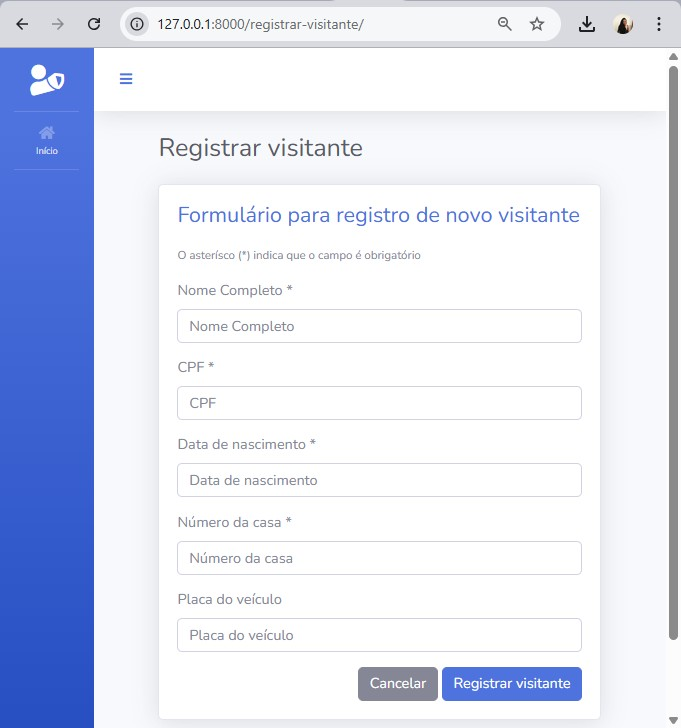
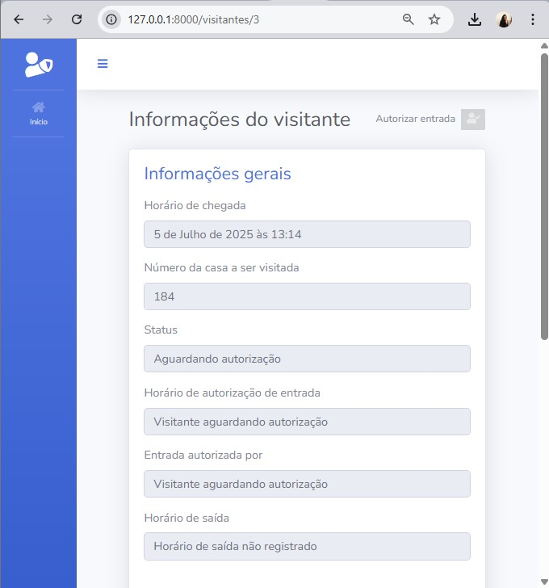
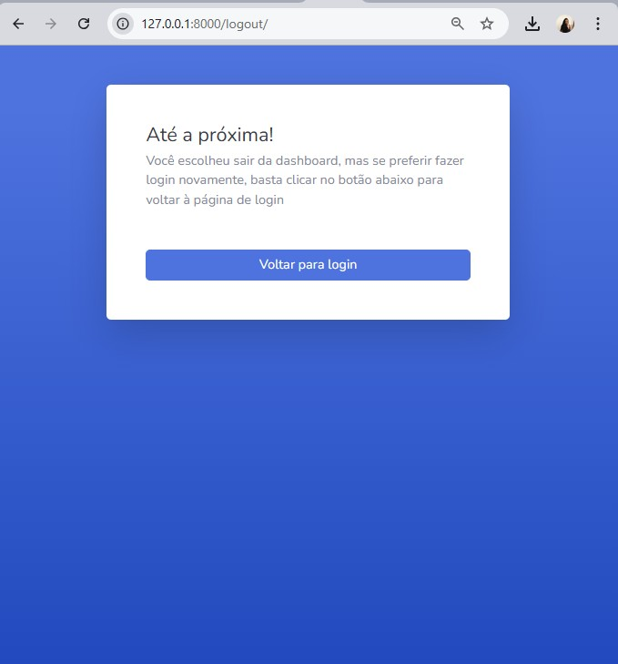

# 🛡️ Controle de Visitantes

Sistema web desenvolvido com **Django 5.0** e **Python 3.10** para registrar e gerenciar visitantes em condomínios residenciais, com interface baseada no template **SB Admin 2**.

## 🎯 Objetivo do Projeto

O **Controle de Visitantes** tem como propósito fornecer uma plataforma simples e eficiente para porteiros e administradores registrarem, acompanharem e visualizarem o fluxo de visitantes em tempo real, garantindo segurança e rastreabilidade.

<div style="text-align: center;">
  
</div>

Funcionalidades planejadas:

- Cadastro e autenticação de porteiros e administradores
- Registro de visitantes aguardando autorização
- Registro de visitantes atualmente no condomínio
- Histórico de visitas finalizadas
- Listagem dos visitantes do mês

## 🧰 Tecnologias utilizadas

- Python 3.10
- Django 5.0
- SQLite (como banco de dados padrão)
- HTML5, CSS3, JavaScript
- Bootstrap 4 (via SB Admin 2)
- Font Awesome

## 🚀 Instalação e uso local

### Pré-requisitos

- Python 3.10 instalado
- Git (opcional, para clonar o repositório)

### Passo a passo

1. Clone este repositório (ou baixe o ZIP):

   ```bash
   git clone https://github.com/seu-usuario/controle-visitantes.git
   cd controle-visitantes
   ```

2. Crie e ative um ambiente virtual:
  
   ```bash
   # Windows
   python -m venv env
   env\Scripts\activate
   ```
  
   ```bash
   # Linux/macOS
   python3 -m venv env
   source env/bin/activate
   ```

3. Instale as dependências:

   ```bash
   pip install django==5.0
   ```

4. Execute as migrações do banco de dados:

   ```bash
   python manage.py makemigrations {app_name}
   python manage.py migrate
   ```

5. Inicie o servidor de desenvolvimento:

   ```bash
   python manage.py runserver
   ```

6. Acesse a aplicação no navegador:

   ```bash
   http://127.0.0.1:8000/
   ```

## 🗂️ Estrutura do projeto
   ```c#
  controle-visitantes/
  │
  ├── manage.py                   # Comando principal do Django
  ├── db.sqlite3                  # Banco de dados local
  ├── .gitignore                  # Git ignore padrão
  ├── README.md                   # Documentação do projeto
  │
  ├── apps/                       # Aplicativos da regra de negócio
  │   ├── dashboard/              # Página inicial e dashboard do sistema
  │   ├── porteiros/              # App responsável pelos registros dos porteiros
  │   ├── usuarios/               # App de autenticação e gerenciamento de usuários
  │   └── visitantes/             # App responsável pelo controle de visitantes
  │
  ├── controle_visitantes/       # Configurações principais do Django (settings, urls, wsgi)
  │
  ├── static/                     # Arquivos estáticos compartilhados (CSS, JS, vendor)
  │
  ├── templates/                  # Templates HTML globais (base.html, login.html etc)
  │
  └── img/                        # Imagens utilizadas no sistema e documentação

   ```

## 📌 Páginas

1. Página de Login
   
  <div style="text-align: center;">
    
  </div>
  
2. Página Inicial
   
  <div style="text-align: center;">
    
  </div>

3. Página Administrativa
   
  <div style="text-align: center;">
    
  </div>
  
4. Página de Registrar Visitantes
   
  <div style="text-align: center;">
    
  </div>
  
5. Página sobre Informações de Visitantes
   
  <div style="text-align: center;">
    
  </div>
  
6. Página de Logout
   
  <div style="text-align: center;">
    
  </div>
  

## 📄 Licença
Este projeto é de uso educacional e livre para modificação. Você pode adaptá-lo conforme necessário.
